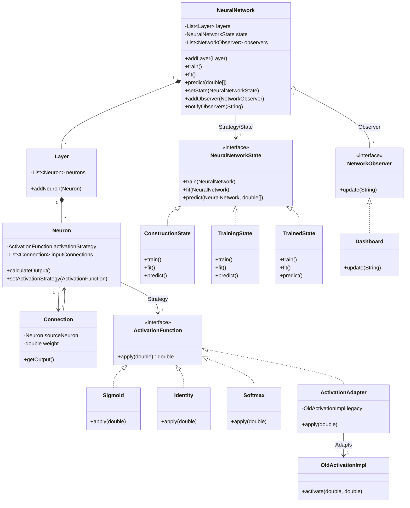

# Diagramme de Classe - Framework Réseau de Neurones

**Énoncé :** Établir un diagramme de classe qui représente le mieux le modèle en appliquant les design patterns appropriés.

```mermaid
classDiagram
    class NeuralNetwork {
        -List~Layer~ layers
        -NeuralNetworkState state
        -List~NetworkObserver~ observers
        +addLayer(Layer)
        +train()
        +fit()
        +predict(double[])
        +setState(NeuralNetworkState)
        +addObserver(NetworkObserver)
        +notifyObservers(String)
    }

    class Layer {
        -List~Neuron~ neurons
        +addNeuron(Neuron)
    }

    class Neuron {
        -ActivationFunction activationStrategy
        -List~Connection~ inputConnections
        +calculateOutput()
        +setActivationStrategy(ActivationFunction)
    }

    class Connection {
        -Neuron sourceNeuron
        -double weight
        +getOutput()
    }

    %% Strategy Pattern
    class ActivationFunction {
        <<interface>>
        +apply(double) double
    }
    class Sigmoid {
        +apply(double)
    }
    class Identity {
        +apply(double)
    }
    class Softmax {
        +apply(double)
    }
    class ActivationAdapter {
        -OldActivationImpl legacy
        +apply(double)
    }
    class OldActivationImpl {
        +activate(double, double)
    }

    %% State Pattern
    class NeuralNetworkState {
        <<interface>>
        +train(NeuralNetwork)
        +fit(NeuralNetwork)
        +predict(NeuralNetwork, double[])
    }
    class ConstructionState {
        +train()
        +fit()
        +predict()
    }
    class TrainingState {
        +train()
        +fit()
        +predict()
    }
    class TrainedState {
        +train()
        +fit()
        +predict()
    }

    %% Observer Pattern
    class NetworkObserver {
        <<interface>>
        +update(String)
    }
    class Dashboard {
        +update(String)
    }

    %% Relationships
    NeuralNetwork "1" *-- "*" Layer
    Layer "1" *-- "*" Neuron
    Neuron "1" --> "*" Connection
    Connection --> "1" Neuron
    
    NeuralNetwork --> "1" NeuralNetworkState : Strategy/State
    NeuralNetworkState <|.. ConstructionState
    NeuralNetworkState <|.. TrainingState
    NeuralNetworkState <|.. TrainedState

    Neuron --> "1" ActivationFunction : Strategy
    ActivationFunction <|.. Sigmoid
    ActivationFunction <|.. Identity
    ActivationFunction <|.. Softmax
    ActivationFunction <|.. ActivationAdapter
    ActivationAdapter --> "1" OldActivationImpl : Adapts

    NeuralNetwork "1" o-- "*" NetworkObserver : Observer
    NetworkObserver <|.. Dashboard
```
